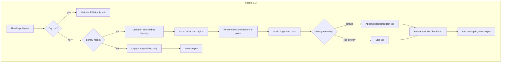

# NAEGIA-Obfuscator

Small Rust workspace for post-processing PE32+ AMD64 executables on Windows. You run `naegia protect` on an `.exe`; the tool rewrites header-level metadata and optional noise after the mapped image, then fixes the PE checksum. Code and data sections stay on disk as they were, so the loader still sees the same RVAs and the program should behave the same.

The main target is `x86_64-pc-windows-msvc` builds (for example `cargo build --release`). Other PE64 files might work if they pass the same checks.

## How the workflow runs

Rough order of operations when you are not using `--identity`:



Identity mode skips E through L: you get either a byte copy or debug-directory stripping plus checksum, with no stub or name games.

The static fingerprint pass rewrites header fields that scanners and first-pass RE triage lean on (build time, linker and image version words, bound-import directory pointer, COFF symbol table fields). None of that is required for the loader to map your image. The pass is cheap noise, not secrecy: anyone with time can still disassemble `.text`, follow strings, and trace behavior.

If you need real resistance, you are looking at import encryption, a packer or split loader, control-flow obfuscation, string encryption, and anti-debug. Those belong in a different tool chain. NAEGIA stays in the “mess with the easy static story” lane on purpose.

## Repository layout

```text
NAEGIA-Obfuscator/
├── Cargo.toml                 # workspace root
├── rust-toolchain.toml
├── crates/
│   ├── naegia/                # `naegia` binary, clap CLI
│   └── naegia-pe/             # PE parse, validate, transforms
├── fixtures/
│   └── hello-windows/         # tiny exe built by integration tests
└── .github/workflows/ci.yml
```

## Build

```bash
cargo build --workspace --release
```

The `naegia` binary ends up under `target/release/` (or `target/debug/` without `--release`).

## CLI examples

```bash
# Default: stub, section names, static fingerprint pass, entropy tail, checksum
naegia protect path/to/app.exe -o path/to/out.exe

# Same transforms but no extra bytes after the PE (signing-friendly size)
naegia protect path/to/app.exe -o path/to/out.exe --no-overlay

# Exact copy of the file (validation only, then write the same bytes)
naegia protect path/to/app.exe -o path/to/copy.exe --identity

# Validate input only; output path is ignored and not created
naegia protect path/to/app.exe -o /dev/null --dry-run

# Clear the Debug data directory entry, then run the default obfuscation stack
naegia protect path/to/app.exe -o path/to/out.exe --strip-debug

# Strip debug pointer only, no stub/name/timestamp/overlay changes
naegia protect path/to/app.exe -o path/to/out.exe --identity --strip-debug
```

## Aggressive layers (opt-in)

These stack on top of the default path (unless you use `--identity`). Combine with `--no-overlay` if you care about signatures or file size.

```bash
# Decoy packer-style section names + preset COFF timestamps
naegia protect app.exe -o out.exe --decoy-metadata

# Entropy tail alternates random / ASCII / NOP-like blocks
naegia protect app.exe -o out.exe --patterned-overlay

# Max cosmetic linker + image version fields
naegia protect app.exe -o out.exe --nuclear-metadata --no-overlay

# XOR long runs of 0x00 padding inside .rdata on disk (strings untouched)
naegia protect app.exe -o out.exe --xor-rdata-zero-runs --no-overlay

# Entry point jumps through a code cave (jmp to original EP)
naegia protect app.exe -o out.exe --redirect-entry --no-overlay

# Same, plus spin if PEB.BeingDebugged (use only when you accept anti-debug behavior)
naegia protect app.exe -o out.exe --redirect-entry --anti-debug-entry --no-overlay
```

Flags that are **wired but not implemented yet** (CLI returns a clear error): `--scramble-imports`, `--flatten-cfg`, `--junk-imports N` (N > 0), `--opaque-predicates`. Import hashing helpers live in `naegia-pe` (`hash_name_ror13_upper`) for the future resolver stub.

Typical Rust release pipeline:

```bash
cargo build --release
naegia protect target/release/my_app.exe -o dist/my_app.exe --strip-debug
```

## What actually changes

- DOS stub (bytes between the end of the fixed DOS header and `e_lfanew`): overwritten with a deterministic pattern. `MZ`, `e_lfanew`, and the PE headers that follow stay coherent.
- Section names in the section table: replaced with generated 8-byte names. Indirect names that start with `/` are left alone so string-table layouts do not break.
- COFF `TimeDateStamp`: XOR-mixed with a seed derived from the file. The loader does not use this for execution.
- Optional header `MajorLinkerVersion` / `MinorLinkerVersion`: XOR-mixed with the same seed. Scanners infer toolchain from these; the loader ignores them.
- Optional header `MajorImageVersion` / `MinorImageVersion`: same idea, cosmetic for normal EXEs.
- Data directory entry for bound imports: zeroed so the loader does full IAT binding and static “bound hint” views go stale.
- COFF `PointerToSymbolTable` / `NumberOfSymbols`: forced to zero (normal MSVC release builds already ship that way).
- Entropy tail (unless `--no-overlay`): `DEFAULT_ENTROPY_OVERLAY_LEN` bytes (see `naegia-pe`) appended after the last byte of the original file. That raises whole-file entropy and annoys naive static signatures. It also invalidates Authenticode if the file was signed, so use `--no-overlay` when you care about signatures or need the file length unchanged.

Static import DLL names (the ones Dependency Walker style tools show) stay the same. Anything loaded with `LoadLibrary` at runtime is outside what this tool inspects.

## References

- [PE format (Microsoft Learn)](https://learn.microsoft.com/en-us/windows/win32/debug/pe-format)
- [Cargo profiles](https://doc.rust-lang.org/cargo/reference/profiles.html)
- [Dependencies](https://github.com/lucasg/Dependencies) for comparing direct imports before and after a run

## Release profile (Rust side)

Stripping symbols and shrinking the binary is still done in Cargo, not in `naegia`. For example:

```toml
[profile.release]
strip = "debuginfo"
lto = false
codegen-units = 16
```

Details: [Cargo profiles](https://doc.rust-lang.org/cargo/reference/profiles.html).

## Tests

```bash
cargo test --workspace
```

Windows-only integration tests: `protect_windows.rs` (baseline), `protect_layers_windows.rs` (aggressive flags + unsupported guards), and `protect_regression_windows.rs` (identity precedence, dry-run, invalid PE, double protect, full flag stack, no output on failure). CI uses `windows-latest`.

## Production / MVP checklist

- **Toolchain**: Rust **1.82+** (`rust-version` in the workspace `Cargo.toml`, `rust-toolchain.toml` pins stable).
- **CI** (GitHub Actions on `windows-latest`): `cargo fmt --check`, `cargo clippy -D warnings`, full workspace tests in debug, **release** build, then integration tests on **release** `naegia`.
- **Ship binary**: `cargo build -p naegia --release` → `target/release/naegia.exe` (release profile uses thin LTO + `strip`).
- **Smoke on your machine**: run the same as CI, or at least `cargo test --workspace` on Windows before tagging a release.
- **Scope**: treat aggressive flags as opt-in; default `protect` path is what MVP users should run first. Signed binaries still need `--no-overlay` if you append the entropy tail.
- **GitHub Release**: push a tag `v0.1.0` (or any `v*`) to run `.github/workflows/release.yml`, which attaches `naegia.exe` to a release (needs `contents: write`, satisfied for the default `GITHUB_TOKEN` on public repos).

## License

MIT. See [LICENSE](LICENSE).
